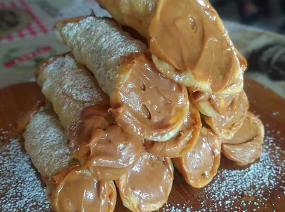

# Pasta e Magia di Totó 🍝

Site institucional/cardápio do restaurante **Pasta e Magia di Totó**, do chef
Salvatore Costantino. Site estático (HTML, CSS e JS puros), pronto para publicar
no GitHub Pages.

## Estrutura de pastas

```
PastaeMagia/
├── index.html
├── css/
│   └── style.css
├── js/
│   └── script.js
├── images/          <- coloque aqui as fotos reais
│   ├── pastamagia.jpg      -> logo/ícone do site
│   ├── salvatore.png       -> foto real do chef
│   ├── carbonara.png       -> foto real do prato (Carbonara alla Chicago)
│   ├── carbonaratoto.png   -> foto real do prato (Carbonara di Totó)
│   ├── fazzoletti.png      -> foto real do prato (Fazzoletti Rossi)
│   ├── lasagna.png         -> foto real do prato (Lasagna in Padella)
│   ├── genovese.png        -> foto real do prato (Spaghetti Pesto Genovese alla Chicago)
│   └── canolli.png         -> foto real do prato (Cannolo Dolce di Latte di Totó)
└── README.md
```

## 1. Trocar as imagens

Todos os pratos do cardápio e o chef já usam fotos reais. Para trocar
qualquer uma por uma foto nova, é só:

1. Salvar a foto em `images/` (formato `.jpg`, `.png` ou `.webp`).
2. Abrir `index.html` e trocar o `src` do `` do prato desejado. Exemplo:
   ```html
   <!-- antes -->
   
   <!-- depois -->
   
   ```
3. Recomendações de tamanho:
   - Foto do chef: proporção retrato (ex.: 800×1000px).
   - Fotos dos pratos: proporção 4:3 (ex.: 1200×900px).
   - Use fotos comprimidas (JPEG de qualidade 70–85%) para o site carregar rápido.

## 2. Colocar os links reais de iFood, Keeta e 99

Cada prato tem 3 botões com `href="#"`. Procure por eles em `index.html`
(um bloco `delivery-buttons` por prato) e troque `#` pelo link real da sua loja
em cada plataforma, por exemplo:

```html
<a class="delivery-btn ifood" href="https://www.ifood.com.br/delivery/sua-cidade/seu-restaurante" target="_blank" rel="noopener noreferrer">iFood</a>
<a class="delivery-btn keeta" href="https://www.keeta.com/sua-loja" target="_blank" rel="noopener noreferrer">Keeta</a>
<a class="delivery-btn noventa-nove" href="https://99food.com.br/sua-loja" target="_blank" rel="noopener noreferrer">99</a>
```

Dica: se o link for o mesmo para todos os pratos (leva para a página geral da
loja no app), basta usar a mesma URL em todos os botões daquele tipo.

O rodapé do site é só a linha de copyright: não há links, endereço,
telefone ou redes sociais nele. O pedido acontece direto nos botões de
cada prato no cardápio.

## 3. Testar localmente

Basta abrir o arquivo `index.html` duas vezes clicando nele, ou rodar um
servidor local (opcional, mas evita problemas de cache):

```powershell
# na pasta do projeto
python -m http.server 8000
# depois acesse http://localhost:8000 no navegador
```

## 4. Publicar no GitHub Pages

Mesmo passo a passo que você já usou no currículo:

```powershell
git init
git add .
git commit -m "Site do Pasta e Magia di Totó"
git branch -M main
git remote add origin https://github.com/SEU-USUARIO/pasta-e-magia-di-toto.git
git push -u origin main
```

Depois, no GitHub:

1. Vá em **Settings > Pages** do repositório.
2. Em "Build and deployment", escolha **Deploy from a branch**.
3. Branch: `main`, pasta: `/root`.
4. Salve. Em alguns minutos o site estará em:
   `https://SEU-USUARIO.github.io/pasta-e-magia-di-toto/`

## Paleta de cores usada

| Cor | Uso |
|---|---|
| `#c0392b` (tomate) | destaque principal, botões, títulos |
| `#d4a017` (dourado azeite) | detalhes, bordas, hover |
| `#4c7031` (manjericão) | pequenos detalhes/acentos |
| `#f5e6c8` (massa/creme) | fundo claro das seções |
| `#2b1810` (marrom café) | header, rodapé, fundo do hero |
